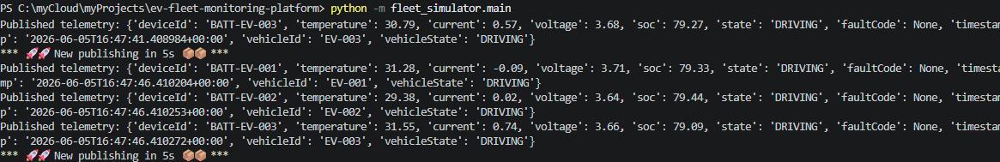
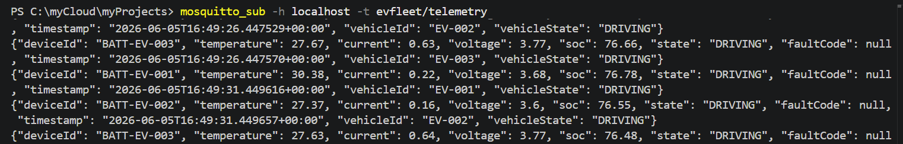

# 🚗 EV Fleet Monitoring Platform


## 📖 Overview

EV Fleet Monitoring Platform is a cloud-native Azure IoT project that simulates a fleet of electric vehicles and their battery systems, generates realistic telemetry data, and transports telemetry through an MQTT-based architecture toward Azure cloud services.

The project demonstrates real-world concepts in:

* ☁️ Cloud Architecture
* 📡 IoT Communication
* 🖥️ Edge Computing
* 🔄 Event-Driven Systems
* 🏗️ Infrastructure as Code
* ⚡ Azure Serverless

---

# 🚀 Current Status

| Component                 | Status |
| ------------------------- | ------ |
| Fleet Simulator           | ✅      |
| Battery ECU Simulation    | ✅      |
| Scenario Engine           | ✅      |
| MQTT Publisher            | ✅      |
| Mosquitto Integration     | ✅      |
| End-to-End Telemetry Flow | ✅      |
| Edge Gateway              | 🚧     |
| Azure IoT Hub             | ⏳      |
| Azure Functions           | ⏳      |
| Cosmos DB                 | ⏳      |

---

# 🚀 Current Project Status

## ✅ Implemented

### 🚗 Fleet Simulation

* Multiple simulated EVs
* Fleet management engine
* Vehicle lifecycle simulation
* Scenario-driven behavior

### 🔋 Battery ECU Simulation

Each Battery ECU generates:

* State of Charge (SOC)
* Temperature
* Voltage
* Current
* Fault conditions
* UTC timestamps

### 🎭 Scenario Engine

Implemented scenarios:

* Normal Driving
* Fast Charging
* Low Battery
* Overheating

### 📡 MQTT Integration

Validated end-to-end:

* Mosquitto MQTT Broker
* MQTT Publisher
* JSON Serialization
* Continuous Telemetry Publishing
* MQTT Subscriber Validation

Successfully validated flow:

```text
Vehicle
    ↓
Battery ECU
    ↓
Fleet Simulator
    ↓
MQTT Publisher
    ↓
Mosquitto Broker
    ↓
MQTT Subscriber
```

---

# ✅ Current Architecture


---

# 🎯 Target Architecture


---

# 📦 Example Telemetry

```json
{
  "deviceId": "BATT-EV-001",
  "temperature": 31.4,
  "current": -0.04,
  "voltage": 3.67,
  "soc": 79.77,
  "state": "DRIVING",
  "faultCode": null,
  "timestamp": "2026-06-05T16:08:20.227267+00:00",
  "vehicleId": "EV-001",
  "vehicleState": "DRIVING"
}
```

---

# ▶️ Running the Simulator

### Start MQTT Subscriber

```bash
mosquitto_sub -h localhost -t evfleet/telemetry
```

### Run Fleet Simulator

```bash
python -m fleet_simulator.main
```

Telemetry messages are continuously published through MQTT and can be observed in real time through the subscriber.

---

# 📂 Repository Structure

```text
ev-fleet-monitoring-platform/

├── .github/
│   └── workflows/
│
├── fleet_simulator/
│   ├── vehicles/
│   ├── telemetry/
│   └── tests/
│
├── edge_gateway/
│   ├── mqtt_publisher.py
│   ├── gateway.py
│   ├── validator.py
│   └── translator.py
│
├── cloud/
│   ├── functions/
│   └── shared/
│
├── infrastructure/
│   ├── modules/
│   └── environments/
│
└── docs/
    ├── architecture/
    ├── diagrams/
    └── screenshots/
```

---

# 📸 Screenshots

## Fleet Simulator Output



## MQTT Telemetry Stream



---

# 🏆 Key Achievements

* Simulated a fleet of electric vehicles with independent battery systems
* Implemented Battery ECU telemetry generation
* Developed scenario-based simulation behavior
* Implemented MQTT-based telemetry publishing
* Validated end-to-end telemetry flow using Mosquitto
* Built a modular architecture ready for Azure integration
* Created a testable and extensible IoT simulation platform

---

# 🛣️ Roadmap

## Phase 1 — Simulation & MQTT ✅

* Fleet Simulator
* Battery ECU Simulation
* Scenario Engine
* MQTT Publisher
* Mosquitto Integration
* End-to-End Telemetry Validation

## Phase 2 — Edge Processing 🚧

* MQTT Subscriber Gateway
* Telemetry Validator
* Telemetry Translator
* Routing Logic
* Data Normalization

## Phase 3 — Azure Integration ⏳

* Azure IoT Hub
* Azure Functions
* Cosmos DB
* Application Insights
* Azure Monitor

## Phase 4 — Infrastructure as Code ⏳

* Terraform Modules
* Environment Separation
* Automated Provisioning
* CI/CD Deployment Pipelines

## Phase 5 — Production Features ⏳

* Device Twins
* Real-Time Alerting
* Grafana Dashboards
* Fleet Analytics
* Predictive Maintenance Models

---

# 🧠 Lessons Learned

This project focuses on gaining hands-on experience with:

* Python Object-Oriented Design
* MQTT Messaging Patterns
* IoT Architecture Design
* Edge Computing Concepts
* Event-Driven Systems
* Azure Cloud Services
* Infrastructure as Code
* Scalable Telemetry Processing

---

# 👨‍💻 Author

**Ibrahim Ndah**

🎓 Microsoft Certified: Azure Administrator Associate (AZ-104)

☁️ Azure Solutions Architecture Learning Path

🚗 Automotive Systems Engineering Background

⚡ Cloud, IoT & Platform Engineering
