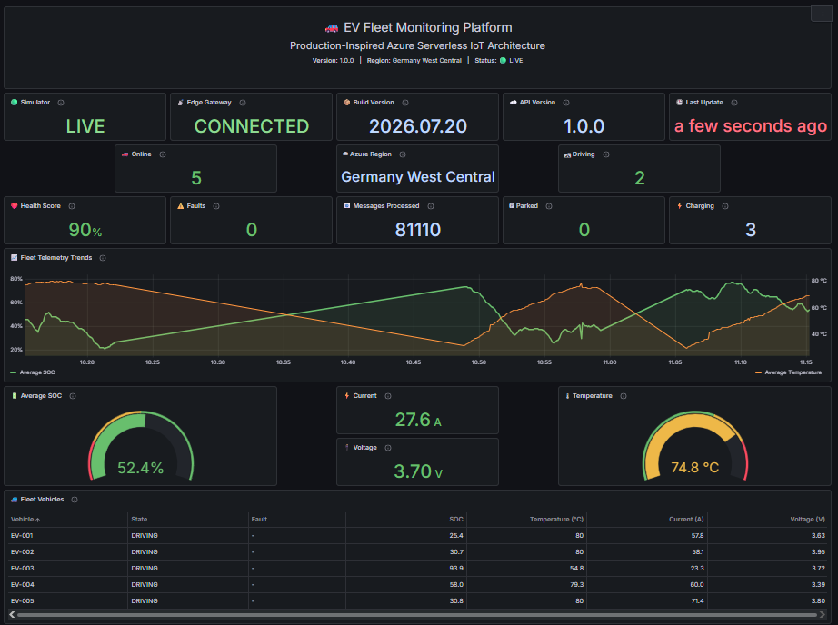
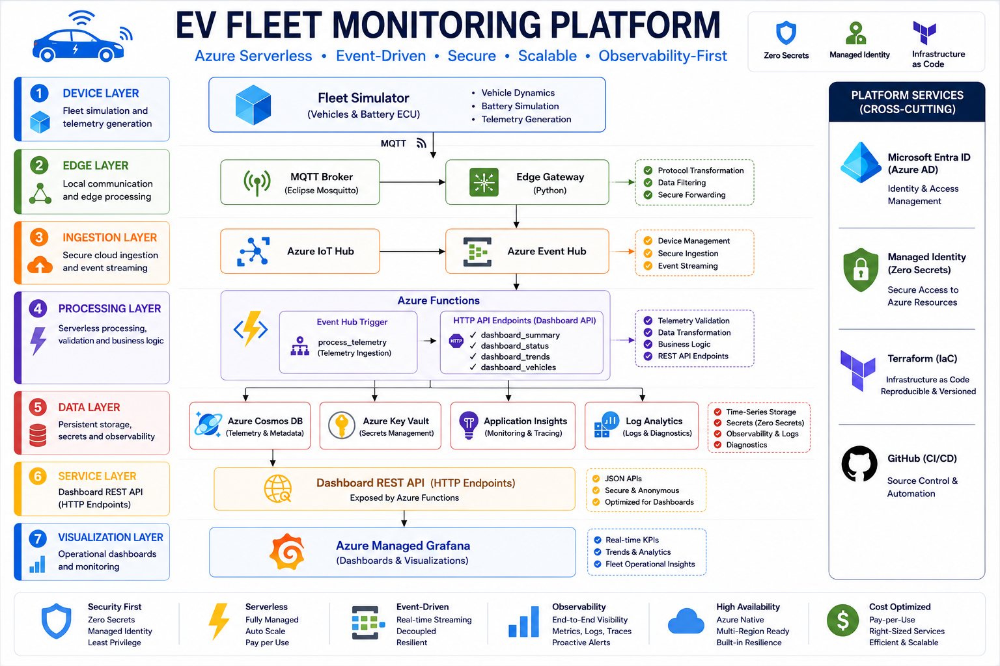
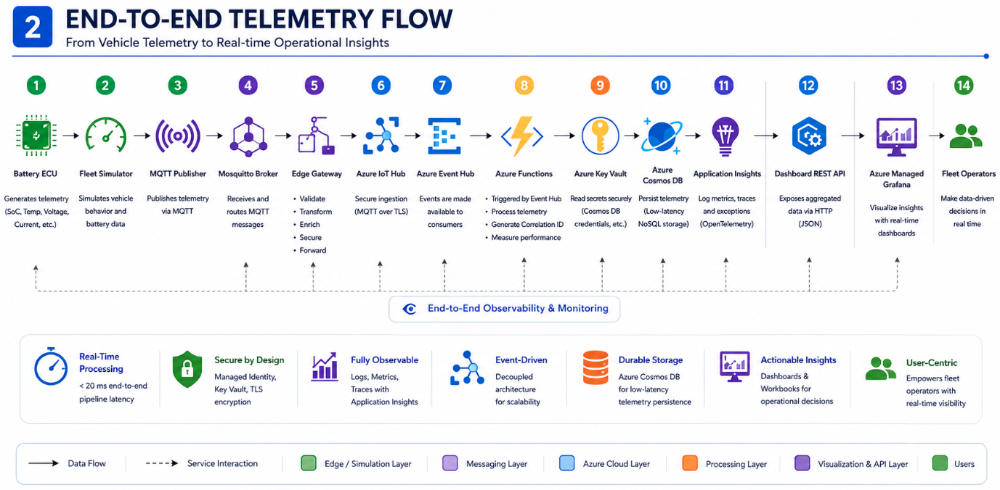
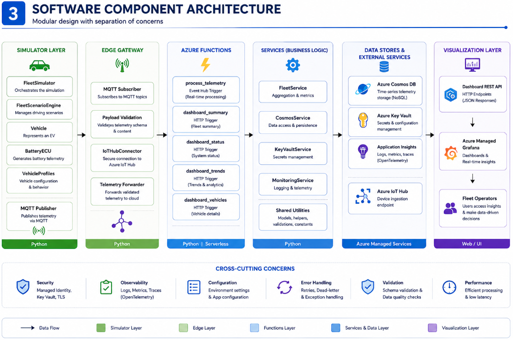
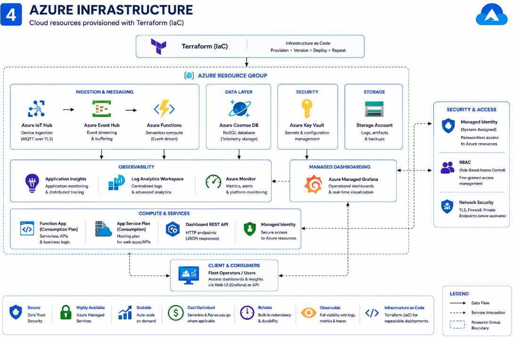
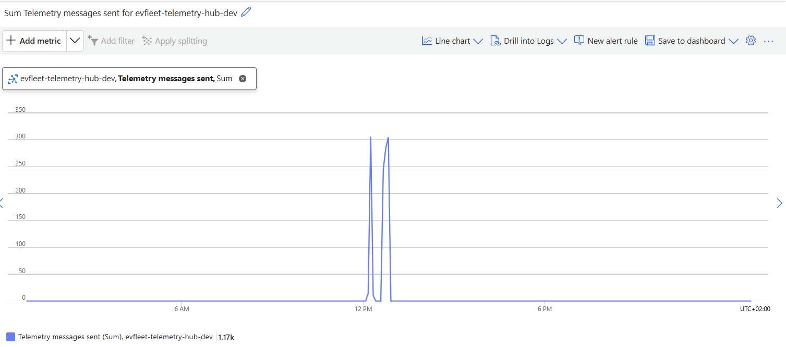
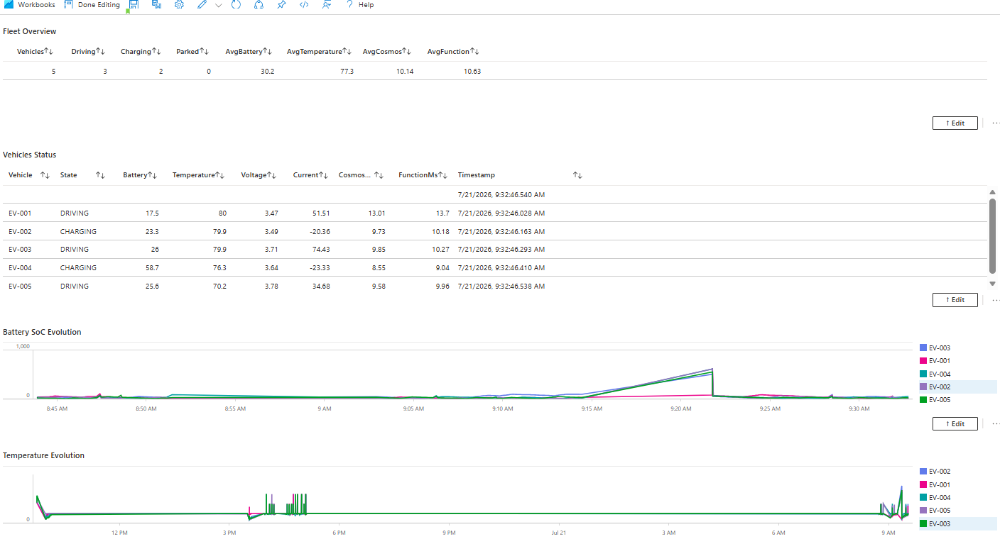
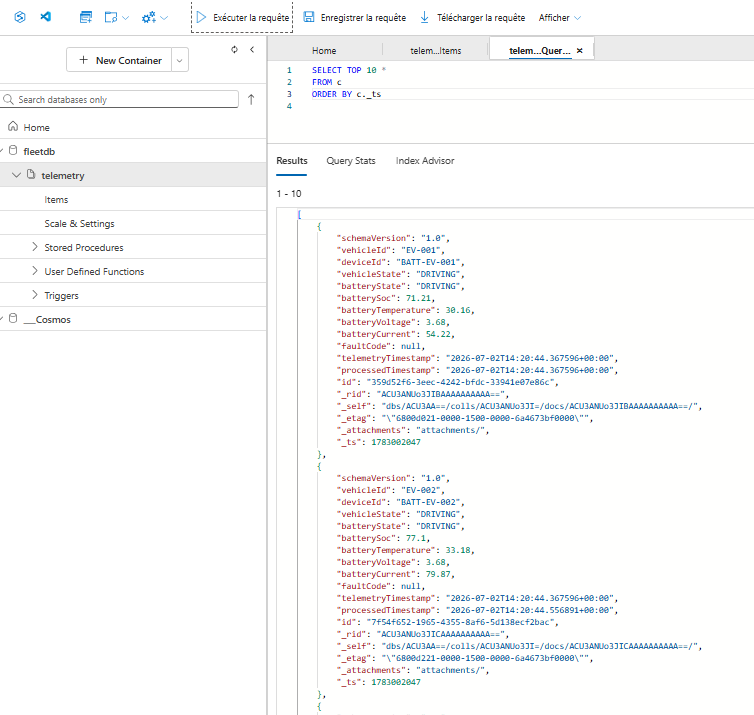
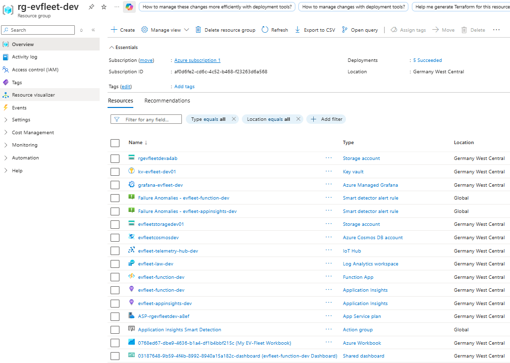

# 🚗 EV Fleet Monitoring Platform

<p align="center">


</p>

---

# Azure Serverless • Event-Driven • IoT • Infrastructure as Code

The **EV Fleet Monitoring Platform** demonstrates how a production-style Azure serverless architecture can securely ingest, process, store, and visualize electric vehicle telemetry in real time.

Designed around modern cloud architecture principles, the solution showcases an end-to-end event-driven pipeline using Microsoft Azure services while emphasizing **Infrastructure as Code**, **Managed Identity**, **Zero Secrets**, and **End-to-End Observability**.

---

<p align="center">

## 📸 Platform Dashboard



</p>

---

# 📊 Executive Snapshot

| Category | Details |
|-----------|----------|
| ☁️ Cloud Platform | Microsoft Azure |
| 🏗️ Architecture Style | Serverless Event-Driven |
| 🚗 Business Domain | Electric Vehicle Fleet Monitoring |
| 💻 Language | Python 3.11 |
| ⚡ Compute | Azure Functions |
| 📡 Messaging | MQTT · Azure IoT Hub · Azure Event Hub |
| 🗄️ Database | Azure Cosmos DB |
| 📊 Monitoring | Grafana · Application Insights · Log Analytics |
| 🔐 Security | Managed Identity · Azure Key Vault |
| 🏗️ Infrastructure | Terraform |
| 🌐 APIs | REST / JSON |
| 📈 Observability | End-to-End Monitoring |

---

# ✨ Key Features

| Capability | Description |
|------------|-------------|
| 🚗 Fleet Simulation | Generates realistic electric vehicle telemetry using configurable driving scenarios. |
| ☁️ Cloud-Native | Built entirely on Azure serverless services. |
| 📡 IoT Connectivity | Streams telemetry through MQTT, Azure IoT Hub, and Event Hub. |
| ⚡ Event Processing | Processes telemetry in real time with Azure Functions. |
| 🗄️ Data Platform | Stores telemetry efficiently in Azure Cosmos DB. |
| 📊 Operational Dashboards | Exposes REST APIs powering live Grafana dashboards. |
| 📈 Observability | Integrates Application Insights, Log Analytics, and Azure Monitor. |
| 🔒 Secure by Design | Implements Managed Identity and Azure Key Vault following Zero Trust principles. |
| 🏗️ Infrastructure as Code | Deploys Azure resources using modular Terraform configurations. |

---

# 🌍 Business Context

Electric vehicle fleets continuously generate telemetry such as battery state of charge, voltage, current, temperature, charging status, and vehicle health.

Fleet operators require immediate visibility into these metrics to improve operational efficiency, detect anomalies, reduce downtime, and optimize charging strategies.

This project demonstrates how a modern Azure cloud platform can transform raw telemetry into actionable operational insights through a scalable, secure, and observable event-driven architecture.

Rather than focusing on individual Azure services, the platform emphasizes architectural design principles and illustrates how cloud-native components collaborate to build an enterprise-grade IoT solution.

---

# 🏗️ Executive Architecture

The platform follows a layered event-driven architecture where each component has a clearly defined responsibility.

Telemetry flows from simulated vehicles through an edge layer into Microsoft Azure, where it is processed, persisted, and exposed through REST APIs before being visualized in real-time dashboards.

The architecture has been designed to maximize scalability, maintainability, security, and operational visibility.

<p align="center">



</p>


# 🏛️ Architecture Principles

The platform has been designed around modern cloud architecture principles commonly adopted in enterprise environments. Every technology choice supports a specific architectural objective, ensuring that the solution remains scalable, maintainable, secure, and cloud-native.

| Principle | Implementation |
|-----------|----------------|
| ⚡ Event-Driven | Telemetry is processed asynchronously through Azure IoT Hub and Azure Event Hub, enabling loose coupling between producers and consumers. |
| ☁️ Serverless | Azure Functions automatically scale according to telemetry volume while minimizing operational overhead. |
| 🔒 Zero Secrets | Managed Identity and Azure Key Vault eliminate hardcoded credentials and centralize secret management. |
| 🧩 Loose Coupling | Each layer communicates through messaging services and well-defined REST APIs, allowing components to evolve independently. |
| 📊 Observability | Application Insights, Azure Monitor, Log Analytics, and Grafana provide complete operational visibility across the platform. |
| 🏗️ Infrastructure as Code | Terraform provisions the complete Azure environment through reusable and version-controlled modules. |
| 📈 Scalability | Independent services can scale horizontally without impacting the overall architecture. |

<p align="center">


</p>

---

# 📡 End-to-End Telemetry Flow

Every telemetry message follows the same processing pipeline—from generation inside the simulator to visualization in Grafana dashboards.

<p align="center">

## 📐 End-to-End Telemetry Flow



</p>

### Processing Pipeline

| Step | Description |
|------|-------------|
| **1. Fleet Simulation** | The Fleet Simulator generates realistic battery telemetry for multiple electric vehicles. |
| **2. MQTT Publishing** | Telemetry is published to the local MQTT Broker using lightweight IoT messaging. |
| **3. Edge Processing** | The Edge Gateway validates telemetry and securely forwards messages to Azure IoT Hub. |
| **4. Cloud Ingestion** | Azure Event Hub streams telemetry events to Azure Functions. |
| **5. Processing** | Azure Functions validate, transform, enrich, and process incoming telemetry. |
| **6. Storage** | Processed telemetry is persisted in Azure Cosmos DB for low-latency access. |
| **7. API Layer** | HTTP-triggered Azure Functions expose aggregated telemetry through REST endpoints. |
| **8. Visualization** | Azure Managed Grafana displays fleet health, KPIs, trends, and operational dashboards in real time. |

---

# 💻 Technology Stack

The solution combines Azure-native services with open-source technologies to build a complete cloud-native IoT platform.

| Layer | Technologies |
|--------|--------------|
| Programming | Python 3.11 |
| Cloud Platform | Microsoft Azure |
| IoT Messaging | MQTT · Azure IoT Hub · Azure Event Hub |
| Compute | Azure Functions |
| Data Platform | Azure Cosmos DB |
| Security | Managed Identity · Azure Key Vault |
| Monitoring | Azure Monitor · Application Insights · Log Analytics · Grafana |
| Infrastructure | Terraform |
| APIs | REST · JSON |
| Development | Git · GitHub · Visual Studio Code |

---

# 🎯 Why These Technologies?

Every technology included in the platform has been selected to solve a specific architectural challenge rather than simply demonstrating Azure services.

| Technology | Architectural Rationale |
|------------|-------------------------|
| **Azure IoT Hub** | Provides secure, scalable device connectivity and acts as the cloud entry point for telemetry. |
| **Azure Event Hub** | Decouples ingestion from processing using an event-driven architecture capable of handling high telemetry throughput. |
| **Azure Functions** | Offers fully managed serverless compute with automatic scaling and event-driven execution. |
| **Azure Cosmos DB** | Delivers globally scalable, low-latency NoSQL storage optimized for telemetry workloads. |
| **Azure Key Vault** | Centralizes secrets management and integrates seamlessly with Managed Identity. |
| **Managed Identity** | Eliminates embedded credentials while improving application security and operational simplicity. |
| **Grafana** | Provides intuitive, real-time operational dashboards through REST APIs. |
| **Terraform** | Ensures repeatable, version-controlled infrastructure deployments across environments. |

---

> **Architecture Insight**

The platform intentionally separates **data ingestion**, **event processing**, **data persistence**, and **visualization** into independent layers. This separation improves scalability, simplifies maintenance, and allows each component to evolve without affecting the rest of the system—a key characteristic of modern cloud-native architectures.


# 🧩 Software Component Architecture

The platform follows a modular architecture where each component has a single responsibility. This separation of concerns improves maintainability, testability, and future extensibility while keeping the overall system loosely coupled.

<p align="center">

## 📐 Software Component Architecture



</p>

### Core Components

| Layer | Responsibility |
|---------|---------------|
| 🚗 Fleet Simulator | Generates realistic EV telemetry using configurable driving scenarios. |
| 📡 Edge Gateway | Validates MQTT messages and securely forwards telemetry to Azure IoT Hub. |
| ☁️ Cloud Processing | Azure Functions process telemetry, expose REST APIs, and orchestrate cloud services. |
| 🗄️ Data Layer | Azure Cosmos DB stores telemetry optimized for fast querying and dashboard consumption. |
| 📊 Visualization | Azure Managed Grafana provides real-time operational dashboards. |

---

# 🏗️ Infrastructure as Code

The entire cloud environment is provisioned using **Terraform**, enabling repeatable deployments, version-controlled infrastructure, and consistent environments.

Infrastructure provisioning follows a modular approach, allowing each Azure service to be managed independently while remaining part of a unified deployment.

### Provisioned Azure Resources

- Azure IoT Hub
- Azure Event Hub
- Azure Functions
- Azure Cosmos DB
- Azure Key Vault
- Azure Storage Account
- Azure Managed Grafana
- Application Insights
- Log Analytics Workspace

### Benefits

| Capability | Value |
|------------|-------|
| 🔁 Repeatable Deployments | Infrastructure can be recreated consistently across environments. |
| 📦 Version Controlled | Infrastructure changes are tracked using Git. |
| 🧩 Modular Design | Azure resources are organized into reusable Terraform modules. |
| 🚀 Automation | Eliminates manual cloud provisioning. |
| ⚙️ Consistency | Reduces configuration drift between environments. |

---

# ☁️ Azure Infrastructure

The following diagram illustrates the Azure resources deployed by Terraform and how they interact within the platform.

<p align="center">

## 📐 Azure Infrastructure Diagram


</p>

The infrastructure is organized around Azure-native managed services, minimizing operational overhead while maximizing scalability, resiliency, and security.

---

# 📊 Observability

Observability is treated as a **core architectural capability** rather than an operational afterthought.

The monitoring stack provides complete visibility across the telemetry pipeline—from message ingestion to dashboard visualization.

| Service | Purpose |
|----------|---------|
| 📈 Azure Monitor | Platform metrics and service health |
| 🔍 Application Insights | Application telemetry, tracing, and performance monitoring |
| 📋 Log Analytics | Centralized log collection and advanced querying |
| 📊 Azure Managed Grafana | Operational dashboards and fleet visualization |

### Monitoring Capabilities

- Real-time fleet health monitoring
- End-to-end telemetry tracing
- Application performance analysis
- Centralized diagnostics
- Historical trend visualization
- Operational KPI dashboards

---

> **Engineering Insight**

Rather than relying on a single monitoring tool, the platform combines multiple Azure-native observability services with Grafana dashboards to provide operational visibility at every stage of the telemetry lifecycle. This layered monitoring approach reflects enterprise production practices where infrastructure, applications, and business metrics are monitored independently while contributing to a unified operational view.


# 🖼️ Platform Gallery

The following screenshots showcase the platform running in Azure and illustrate the key operational capabilities implemented throughout the project.

From real-time fleet monitoring and application observability to telemetry analytics and data persistence, these views demonstrate how the different Azure services work together to provide a complete end-to-end monitoring solution.

---

### 📈 Application Performance Monitoring

AAzure Application Insights provides end-to-end application observability, including request monitoring, response times, telemetry processing, and operational diagnostics.

<p align="center">
  
</p>

---

### 📊 Azure Workbook

Azure Workbook offers interactive operational analytics by combining Azure Monitor metrics, logs, and telemetry into customizable visual reports.

<p align="center">
  
</p>

---

### 🗄️ Azure Cosmos DB Explorer

Telemetry generated by the simulated vehicle fleet is persisted in Azure Cosmos DB, enabling low-latency queries and historical analysis.

<p align="center">
  
</p>

---

### ☁️ Azure Portal

Cloud resources deployed with Tereraform

<p align="center">
  
</p>

---

# 🎯 Skills Demonstrated

This project demonstrates practical experience across multiple cloud engineering and solution architecture domains.

| Domain | Skills |
|--------|--------|
| ☁️ Cloud Architecture | Azure Serverless · Event-Driven Design · Cloud-Native Architecture |
| 🏗️ Infrastructure | Terraform · Infrastructure as Code · Azure Resource Provisioning |
| 📡 IoT & Messaging | MQTT · Azure IoT Hub · Azure Event Hub |
| ⚡ Backend Engineering | Python · Azure Functions · REST APIs · JSON |
| 🗄️ Data Engineering | Azure Cosmos DB · NoSQL Data Modeling |
| 🔐 Cloud Security | Managed Identity · Azure Key Vault · Zero Secrets |
| 📊 Observability | Grafana · Azure Monitor · Application Insights · Log Analytics |
| 🚀 Engineering Practices | Modular Architecture · Loose Coupling · Scalability · Maintainability |

---

# 🚀 Future Enhancements

The current platform provides a solid foundation that can be extended with additional enterprise capabilities.

- 🤖 Predictive Maintenance using Machine Learning
- 🚘 Azure Digital Twins integration
- 📱 Mobile fleet monitoring application
- 🔔 Real-time alerting and notification workflows
- 📍 GPS route simulation and geospatial analytics
- ⚙️ CI/CD pipeline with GitHub Actions
- 📦 Containerized deployment using Azure Kubernetes Service (AKS)

---

# 📂 Project Structure

```text
EV-Fleet-Monitoring-Platform
│
├── cloud/
│   ├── function_app/
│   ├── services/
│   └── requirements.txt
│
├── edge/
│   ├── gateway/
│   └── mqtt/
│
├── simulator/
│   ├── battery_ecu.py
│   ├── vehicle.py
│   ├── fleet_scenario_engine.py
│   ├── fleet_simulator.py
│   └── vehicle_profiles.py
│
├── grafana/
│   ├── dashboard.json
│   └── README.md
│
├── infrastructure/
│   ├── modules/
│   └── environments/
│
├── docs/
│   ├── diagrams/
│   └── screenshots/
│
└── README.md
```

---

# 🏆 Project Highlights

- ✅ End-to-End Azure Serverless Architecture
- ✅ Event-Driven Telemetry Processing
- ✅ Infrastructure as Code with Terraform
- ✅ Secure Cloud Design using Managed Identity
- ✅ REST API Backend for Operational Dashboards
- ✅ Azure Cosmos DB Integration
- ✅ Enterprise Observability Stack
- ✅ Production-Style Cloud Architecture

---

# 👨‍💻 Author

**Ibrahim Ndah**

Cloud Engineer | Azure Solutions Architect | IoT & Cloud Enthusiast

**Certifications**

- Microsoft Certified: Azure Solutions Architect Expert (AZ-305)
- Microsoft Certified: Azure Administrator Associate (AZ-104)
- Microsoft Certified: Azure Fundamentals (AZ-900)

---

## Connect with me

- 💼 LinkedIn: *www.linkedin.com/in/ibrahim-ndah*

---

<p align="center">

### ⭐ If you found this project interesting, feel free to star the repository!

</p>

