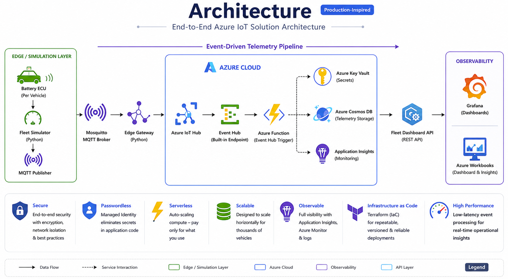
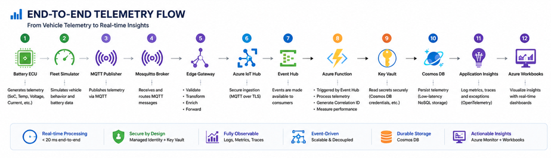

# 🚗 EV Fleet Monitoring Platform

<p align="center">


</p>

---

> **A cloud-native Azure IoT platform that collects, validates, processes, and visualizes electric vehicle telemetry in near real time using an event-driven serverless architecture.**

Modern electric vehicle fleets continuously generate telemetry that must be securely collected, validated, processed, and monitored to ensure operational efficiency, vehicle health, and data-driven decision making.

This project demonstrates how Microsoft Azure services can be combined to build a production-inspired IoT platform featuring **Edge Computing**, **Event-Driven Architecture**, **Serverless Computing**, **Infrastructure as Code**, **Managed Identity**, and **Enterprise Observability**.

---

# 📊 Platform Dashboard

<p align="center">


</p>

> **Real-time fleet monitoring with operational KPIs, battery health, telemetry trends, vehicle status, and platform health.**

---

# 🌍 Business Context

Modern electric vehicle (EV) fleets generate thousands of telemetry events every day. Battery state of charge, temperature, voltage, current, and vehicle status must be continuously monitored to ensure operational efficiency, driver safety, and predictive maintenance.

Building a scalable telemetry platform requires much more than simply collecting data. Incoming events must be validated, securely ingested, processed in near real time, stored efficiently, and transformed into actionable operational insights.

This project demonstrates how these challenges can be addressed using a cloud-native Azure architecture built around event-driven communication, serverless processing, secure identity management, and enterprise observability.

### Business Goals

- Collect telemetry from multiple simulated electric vehicles.
- Validate telemetry at the Edge before cloud ingestion.
- Process events using a scalable serverless architecture.
- Persist telemetry efficiently in Azure Cosmos DB.
- Expose fleet KPIs through a Dashboard API.
- Monitor fleet health using Grafana and Azure Monitor.

---

# 🚀 Solution Overview

The platform simulates an electric vehicle fleet and reproduces a complete production-inspired telemetry pipeline, from data generation inside Battery ECUs to real-time operational dashboards.

```text
Battery ECU
      │
Vehicle Simulator
      │
MQTT Broker
      │
Edge Gateway
      │
Azure IoT Hub
      │
Azure Functions
      │
Azure Cosmos DB
      │
Fleet Dashboard API
      │
Grafana Dashboard
```

Each component has a single responsibility, resulting in a modular, scalable, secure, and maintainable cloud architecture.

---

# 🏗 Solution Architecture

<p align="center">



</p>

The platform follows an event-driven architecture where telemetry flows asynchronously through loosely coupled Azure services. This design improves scalability, resilience, and maintainability while enabling independent evolution of each component.

---

# 🔄 End-to-End Telemetry Flow

<p align="center">



</p>

The telemetry pipeline follows these processing stages:

1. Battery ECUs generate vehicle telemetry.
2. The Fleet Simulator publishes MQTT messages.
3. The Edge Gateway validates and enriches incoming telemetry.
4. Azure IoT Hub securely ingests cloud-bound events.
5. Azure Functions process telemetry using serverless event-driven execution.
6. Processed telemetry is stored in Azure Cosmos DB.
7. The Fleet Dashboard API exposes aggregated fleet metrics.
8. Grafana visualizes operational KPIs and fleet health in near real time.

---

# 🛠 Technology Stack

| Category | Technologies |
|-----------|--------------|
| Programming Language | Python 3.11 |
| Cloud Platform | Microsoft Azure |
| Messaging | MQTT |
| IoT Platform | Azure IoT Hub |
| Compute | Azure Functions |
| Database | Azure Cosmos DB |
| Security | Azure Key Vault • Managed Identity |
| Monitoring | Azure Monitor |
| Observability | Application Insights • OpenTelemetry |
| Visualization | Grafana • Azure Workbooks |
| Infrastructure | Terraform |
| Version Control | Git • GitHub |

---

# ⭐ Key Features

- 🚗 Multi-vehicle EV Fleet Simulation
- 🌐 MQTT-based Edge Communication
- ☁️ Azure-native Event-Driven Architecture
- ⚡ Serverless Telemetry Processing
- 🗄️ Azure Cosmos DB Persistence
- 🔐 Passwordless Authentication with Managed Identity
- 🔑 Azure Key Vault Integration
- 🏗️ Infrastructure as Code using Terraform
- 📈 Real-Time Fleet Dashboard
- 🔍 OpenTelemetry Distributed Tracing
- 📋 Structured Logging
- 📊 Enterprise Observability with Grafana and Azure Monitor

---
# 📷 Platform Gallery

The following screenshots illustrate the different operational layers of the platform, from fleet monitoring to telemetry persistence and cloud observability.

---

## 📊 Grafana Dashboard

Real-time operational dashboard displaying fleet KPIs, battery health, vehicle status, and telemetry trends.

<p align="center">


</p>

---

## 📈 Azure Workbook

Azure Workbook provides cloud-native operational analytics by combining KQL queries with interactive visualizations for fleet telemetry.

<p align="center">


</p>

---

## 🔍 Application Insights

Application Insights captures telemetry, execution traces, and performance metrics, enabling end-to-end observability and troubleshooting.

<p align="center">


</p>

---

## 🗄 Azure Cosmos DB

Processed telemetry is persisted in Azure Cosmos DB, providing scalable NoSQL storage for historical fleet data and dashboard queries.

<p align="center">


</p>

---

## ☁ Azure Portal

The complete Azure infrastructure is deployed and managed using Terraform, providing a production-inspired cloud environment.

<p align="center">


</p>

---
# 📈 Observability

The platform has been designed with observability as a first-class architectural principle.

Telemetry is collected across the entire processing pipeline, allowing application behavior, performance, and operational health to be monitored in near real time.

### Observability Capabilities

- 📊 Grafana dashboards for operational monitoring
- 📈 Azure Workbooks for cloud-native analytics
- 🔍 Application Insights distributed tracing
- 📋 Structured application logging
- 🔗 Correlation IDs across the telemetry pipeline
- ⚙ OpenTelemetry instrumentation
- 📉 Performance metrics and execution timing
- ☁ Azure Monitor integration

---
# 🎯 Skills Demonstrated

This project demonstrates practical experience designing and implementing a production-inspired Azure IoT solution.

### Cloud Architecture

- Azure IoT Hub
- Azure Functions
- Azure Cosmos DB
- Azure Key Vault
- Managed Identity

### Software Engineering

- Python
- Modular Architecture
- Event-Driven Design
- REST API Development
- Structured Logging

### Cloud Operations

- Grafana
- Azure Monitor
- Application Insights
- OpenTelemetry
- KQL

### Infrastructure & DevOps

- Terraform
- Infrastructure as Code
- Git & GitHub
- Automated Testing

---
