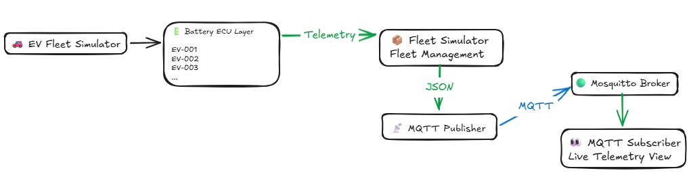
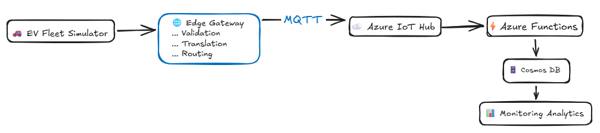

# 🚗 EV Fleet Monitoring Platform


---

## 📖 Overview

EV Fleet Monitoring Platform is a cloud-native Azure IoT project that simulates a fleet of electric vehicles and their battery systems, generates realistic telemetry data, and transports telemetry through an MQTT-based architecture toward Azure cloud services.

The project demonstrates real-world concepts in:

* ☁️ Cloud Architecture
* 📡 IoT Communication
* 🖥️ Edge Computing
* 🔄 Event-Driven Systems
* 🏗️ Infrastructure as Code
* ⚡ Azure Serverless
* 🧪 Automated Testing

---

# 🚀 Current Status

| Component                 | Status |
| ------------------------- | ------ |
| Fleet Simulator           | ✅      |
| Battery ECU Simulation    | ✅      |
| Scenario Engine           | ✅      |
| MQTT Publisher            | ✅      |
| MQTT Subscriber           | ✅      |
| Telemetry Validator       | ✅      |
| Telemetry Translator      | ✅      |
| Edge Gateway              | ✅      |
| End-to-End Telemetry Flow | ✅      |
| Automated Tests           | ✅      |
| Azure IoT Hub             | ⏳      |
| Azure Functions           | ⏳      |
| Cosmos DB                 | ⏳      |

---

# 🏗️ Current Solution Flow

```text
Vehicle
    │
    ▼
Battery ECU
    │
    ▼
Fleet Simulator
    │
    ▼
MQTT Publisher
    │
    ▼
MQTT Broker (Mosquitto)
    │
    ▼
Edge Gateway
    │
    ├── Validator
    ├── Translator
    │
    ▼
Processed MQTT Topic
```

---

# 🚀 Implemented Features

## 🚗 Fleet Simulation

* Multiple simulated EVs
* Fleet management engine
* Vehicle lifecycle simulation
* Scenario-driven behavior

## 🔋 Battery ECU Simulation

Each Battery ECU generates:

* State of Charge (SOC)
* Temperature
* Voltage
* Current
* Fault conditions
* UTC timestamps

## 🎭 Scenario Engine

Implemented scenarios:

* Normal Driving
* Fast Charging
* Low Battery
* Overheating

## 📡 MQTT Integration

Validated end-to-end:

* Mosquitto MQTT Broker
* MQTT Publisher
* MQTT Subscriber
* JSON Serialization
* Continuous Telemetry Publishing

## 🌐 Edge Gateway

Implemented:

* MQTT Subscriber
* Telemetry Validation
* Telemetry Translation
* Raw Topic Processing
* Processed Topic Publishing
* Rejected Topic Routing
* Structured Logging

Topics:

```text
evfleet/telemetry/raw
evfleet/telemetry/processed
evfleet/telemetry/rejected
```

---

# ✅ Current Architecture



---

# 🎯 Target Architecture



---

# 📦 Example Telemetry

## Raw Telemetry

```json
{
  "deviceId": "BATT-EV-001",
  "temperature": 31.4,
  "current": -0.04,
  "voltage": 3.67,
  "soc": 79.77,
  "state": "DRIVING",
  "faultCode": null,
  "timestamp": "2026-06-05T16:08:20.227267+00:00",
  "vehicleId": "EV-001",
  "vehicleState": "DRIVING"
}
```

## Processed Telemetry

```json
{
  "schemaVersion": "1.0",
  "vehicleId": "EV-001",
  "deviceId": "BATT-EV-001",
  "vehicleState": "DRIVING",
  "batteryState": "DRIVING",
  "batterySoc": 79.77,
  "batteryTemperature": 31.4,
  "batteryVoltage": 3.67,
  "batteryCurrent": -0.04,
  "faultCode": null,
  "telemetryTimestamp": "2026-06-05T16:08:20.227267+00:00",
  "processedTimestamp": "2026-06-08T11:00:00+00:00"
}
```

---

# 🧪 Testing

Current automated test coverage includes:

## Fleet Simulator

* Vehicle creation
* Fleet creation
* Fleet simulation
* State changes
* Scenario handling
* Battery ECU behavior

## Edge Gateway

* Telemetry validation
* Telemetry translation
* Gateway processing pipeline
* Invalid telemetry handling

Current status:

```text
16 passed in 0.36s
```

Run all tests:

```bash
pytest
```

---

# ▶️ Running the Platform

## Start MQTT Subscriber

```bash
mosquitto_sub -h localhost -t evfleet/telemetry/processed
```

## Start Edge Gateway

```bash
python -m edge_gateway.gateway
```

## Start Fleet Simulator

```bash
python -m fleet_simulator.main
```

---

# 📂 Repository Structure

```text
ev-fleet-monitoring-platform/

├── .github/
│   └── workflows/
│
├── fleet_simulator/
│   ├── vehicles/
│   ├── telemetry/
│   └── tests/
│
├── edge_gateway/
│   ├── gateway.py
│   ├── mqtt_publisher.py
│   ├── mqtt_subscriber.py
│   ├── validator.py
│   ├── translator.py
│   └── tests/
│
├── cloud/
│   ├── functions/
│   └── shared/
│
├── infrastructure/
│   ├── modules/
│   └── environments/
│
└── docs/
    ├── architecture/
    ├── diagrams/
    └── screenshots/
```

---

# 🏆 Key Achievements

* Simulated a fleet of electric vehicles with independent battery systems
* Implemented Battery ECU telemetry generation
* Developed scenario-based simulation behavior
* Implemented MQTT-based telemetry publishing
* Built a complete Edge Gateway processing pipeline
* Implemented telemetry validation and normalization
* Implemented automated unit testing with pytest
* Achieved full test pass rate across simulator and edge gateway components
* Created a modular architecture ready for Azure integration

---

# 🛣️ Roadmap

## Phase 1 — Simulation & MQTT ✅

* Fleet Simulator
* Battery ECU Simulation
* Scenario Engine
* MQTT Publisher
* MQTT Integration
* End-to-End Validation

## Phase 2 — Edge Processing ✅

* MQTT Subscriber
* Telemetry Validator
* Telemetry Translator
* Gateway Processing Pipeline
* Raw / Processed / Rejected Topics
* Automated Tests

## Phase 3 — Configuration Management ⏳

* Centralized Config Module
* MQTT Configuration Management
* Environment-Based Configuration

## Phase 4 — Azure Integration ⏳

* Azure IoT Hub
* Azure Functions
* Cosmos DB
* Application Insights
* Azure Monitor

## Phase 5 — Infrastructure as Code ⏳

* Terraform Modules
* Environment Separation
* Automated Provisioning
* CI/CD Deployment Pipelines

## Phase 6 — Production Features ⏳

* Device Twins
* Real-Time Alerting
* Grafana Dashboards
* Fleet Analytics
* Predictive Maintenance

---

# 🔧 Technical Improvements Backlog

## Edge Gateway

### Dependency Injection

Current implementation creates MQTT dependencies directly inside the gateway.

Benefits of future improvement:

* Improved testability
* Easier mocking
* Reduced coupling
* Better maintainability

---

## Battery ECU Realism

Planned improvements:

* Realistic EV battery pack voltages (350V–800V)
* State-dependent current consumption
* More realistic charging curves
* Battery degradation simulation
* Battery health indicators (SOH)

---

## Configuration Centralization

Future configuration items:

* MQTT host
* MQTT port
* Raw topic
* Processed topic
* Rejected topic

Benefits:

* Easier maintenance
* Environment-specific configurations
* Better scalability

---

## Observability

Planned monitoring improvements:

* Structured logging
* Log aggregation
* Azure Application Insights integration
* Telemetry tracing
* Gateway metrics

---

# 🧠 Lessons Learned

This project provides hands-on experience with:

* Python Object-Oriented Design
* MQTT Messaging Patterns
* IoT Architecture Design
* Edge Computing Concepts
* Event-Driven Systems
* Azure Cloud Services
* Infrastructure as Code
* Scalable Telemetry Processing
* Software Testing and Validation

---

# 👨‍💻 Author

**Ibrahim Ndah**

🎓 Microsoft Certified: Azure Administrator Associate (AZ-104)

🎓 Microsoft Certified: Azure Solutions Architect Expert (AZ-305)

☁️ Cloud Engineering & Azure Architecture

🚗 Automotive Systems Engineering Background

⚡ Cloud, IoT & Platform Engineering
